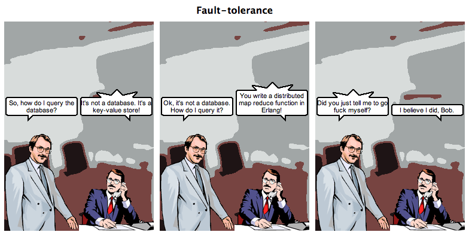

#### Our Little Pony - BuildStuff LT 2015


----

# Our Little Pony

### Darach Ennis (pony padewan learner), 

#### BuildStuff 2015

----

Pony Padewan


I'm just a geek, who loves a pony

----

Pony Yooda


... written at Imperial College in West London

----

## Agenda

Pony Basics

Pony Fibs

Pony Actors

Pony - Compiler says No!

Pony - Runtime says Yes!

Pony/OTP - Pony for Joe!

Pony Promises

Conclusion

----

# Pony. 

## Fast, safe actors, that don't/won't crash (mostly)

http://ponylang.org

----

The actor-model was invented by Carl Hewitt in 1973.


A Universal Modular Actor Formalism for Artificial Intelligence - 1973

----

Gul Agha's 1985 dissertation developed a foundational model which is the basis of all actor-model programming languages.


[ACTORS: A model of concurrent computation in distributed systems](https://www.cypherpunks.to/erights/history/actors/AITR-844.pdf)

----

Erlang/OTP. The most copied and loved implementation of the actor model. "Let it crash!"



[Making reliable distributed systems in the presence of software errors](http://www.erlang.org/download/armstrong_thesis_2003.pdf)

[Erlang the Movie](https://www.youtube.com/watch?v=xrIjfIjssLE) - [Erlang the Movie II - The Sequel](https://www.youtube.com/watch?v=rRbY3TMUcgQ)

----

Compiler oriented "Let it crash" actor technology.

The first intolerant deadlock+data-race free for the greater good actor system!


----

### Actors - Yeah, It's Love!

Combine data, functions and units of execution.

Exploits natural _composable concurrency_.

Make parallel programming easy.


---

## Pony Basics

* Variables, Fields
* Simple Expressions
* Control Expressions
* Error handling
* Pattern Matching
* Algebraic Types
* Primitives, Traits, Interfaces, Classes
* Actors
* C-like Structs & Embed
* Delegates

----

## Variables

```pony
let single_assignment : I64 = 1
var multiple_assignment : Bool = true
embed avoid_ptr_indirection : MyStructClass = MyStructClass
```

## Fields

```pony
class Foo
  let _private : I64 = 1
  var public : Bool = true
  embed ...
```

----

## Expressions

[ a = 1, b = 2, c = 3 ]

Java, C++, C, Scala, ...
```java
long x = a + b * c // Is x 7 or 9?
```

Erlang
```erlang
X = A + B * C %% Is X 7 or 9?
```

Smalltalk
```smalltalk
x := a + b * c "Is it the same as above?"
```

Pony
```pony
let x : I64 = a + (b * c) // No operator precedence - WYSIWYG
let y : U64 = x + I64(1)  // Not allowed! No automatic casting
let y' : U64 = x + I64(1).u64() // Cast it yourself! - WYSIWYG
```

----

## Statements *are* expressions

If is an expression
```pony
let x : I64 = if (a and 1) == 1 
  then a + (b * c) 
  else (a + b) * c 
end // Allowed!
```

For is an expression
```pony
var r = Range[U64](1,10) // Min inclusive, Max exclusive
var x : I64 = a + (for i in r do i else 0 end * c) // ok!
```

----

Errors must be handled [1]

```pony
use "collections"

actor Main
  new create(env : Env) =>
    let a : U64 = 1
    let b : U64 = 2
    let c : U64 = 3
    try
      x = a + (for i in Range[U64](1,10) do i else 0 end * c)
      env.out.print("for: " + x.string())
    else
      env.err.print("Oh noes!")
    end
```

----

Errors must be handled [2]

```pony
  new create(env : Env) => // Bad! ?
    let a : U64 = 1
    let b : U64 = 2
    let c : U64 = 3
    try
      x = a + (for i in Range[U64](1,10) do i else 0 end * c)
      env.out.print("for: " + x.string())
    else
      error // There are no runtime exceptions ( YAGNI, slow, you lost! )
    end
```

----

Errors must be handled [3]

```pony
  new create(env : Env) =>
    let a : U64 = 1
    let b : U64 = 2
    let c : U64 = 3
    try
      x = a + (for i in Range[U64](1,10) do i else 0 end * c)
      env.out.print("for: " + x.string())
    // Swallow!
    end
```

----

Errors must be handled [4]

```pony
  new create(env : Env) =>
    try
      foo()
    // Swallow!
    end

  fun foo() : U64 ? => // Propagate with '?'
    let a : U64 = 1
    let b : U64 = 2
    let c : U64 = 3
    x = a + (for i in Range[U64](1,10) do i else 0 end * c)
```

----

Erlang Style Pattern Matching [1]

13 Yukky Imperetarded LOC
```pony
actor Main
  let a : U64 = 1
  let b : U64 = 2
  new create(env : Env) =>
    if a == b then
      env.out.print("they are the same")
    else
      if a > b then
        env.out.print("a is bigger")
      else
        env.out.print("b bigger")
      end
    end
```

----

Erlang Style Pattern Matching [2]

9 Yummy Matchtastic LOC
```pony
actor Main
  let a : U64 = 2
  let b : U64 = 1
  new create(env : Env) =>
    env.out.print( match (a, b)
      | where a > b => "a is bigger than b"
      | where a < b => "b is bigger than a"
      else "they are the same"
    end)
```

----

Erlang Style Pattern Matching [3]

```pony
actor Main
  let a : U64 = 2
  let b : U64 = 1
  new create(env : Env) =>
    env.out.print( match (a, b)
      | (0, _) => "a is zero, so who cares about b? we don't!"
      | where a > b => "a is greater than zero and bigger than b"
      | where a < b => "a is greater than zero but b is bigger than a"
      else "a is greater than zero and they are the same"
    end)
```

Don't care? Use a '_' wildcard

----

Algebraic Type Expressions [1]

```pony
primitive Red
primitive Green
primitive Blue

type Color is ( Red | Green | Blue )              // Enum/Union with '|'
type ColoredThing is ( String, Color )            // Tuple with ','
type MaybeColoredThing is ( ColoredThing | None ) // Option type with '|'

type Map[
  K: (Hashable box & Comparable[K] box), // Intersection with '&'
  V] 
  is HashMap[K, V, HashEq[K]]
```

----

Algebraic Type Expressions [2]

Creating, accessing, and  destructuring tuple

```pony
var t : (String, Color)       // Define
t = ("Lamp", Green)           // Construct
t = ("Person", t._2)          // Member access
(let name, var color)  = t    // Destructure
```

----

* Primitives
  1. A __primitive__ has no fields.
  2. There is only one instance of a user defined __primitive__.

```pony
primitive Red
primitive Green
primitive Blue

type Color is ( Red | Green | Blue )

```

* Uses
  1. Nominal marker. Like an erlang Atom 
  2. Enumeration. Through unioning
  3. Monostate. 'Package' (related) functions together
  4. Builtins. ( Bool, I8 .. I128, U8 .. U128, F32, F64 )

----

* Traits
  1. Offers __nominal__ subtyping.
  2. No fields
  3. May have default implementations

```pony
trait Named
  fun name(): String => "J. Anonymous Doe"
```

When to use?

* When you want to prevent accidental subtyping

----

Interfaces

Offers __structural__ subtyping. No fields. May have default implementations

```pony
interface val Real[A: Real[A] val] is
  (Stringable & _ArithmeticConvertible & Comparable[A])
  ...
  fun add(y: A): A => this + y

// Define a suitable type
class Pair
  ...
  // Define a + function
  fun add(other: Pair): Pair =>
    Pair(_x + other._x, _y + other._y)

actor Main
  new Create(env : Env) =>
    var x = Pair(1, 2)
    var y = Pair(3, 4)
    env.out.print( (x + y).string() )
```

When to use?  When you want more flexibility. By default, when you can't decide ...

----

Classes

1. Can inherit traits explicitly
2. Can support interfaces (explicitly or implicitly)
  If an interface is explicitly supported default implementations are used
  Otherwise, when using implicit support, default implementatinos are ignored
3. Have constructors. Constructors *MUST* initialize all fields ( RAII )
4. Have fields. May be public or private
5. Can not extend from another class ( YAGNI! )

----

Classes -- Fields

```pony
class Wombat
  let name: String // MUST be initialized in constructors ( once )
  var _hunger_level: U64 = 0 // Default, can be overriden in constructor
```

----

Classes -- Constructors

```pony
class Wombat
  let name: String
  var _hunger_level: U64

  new create(name': String) => // Construct with 'new'
    name = name'
    _hunger_level = 0

  new hungry(name': String, hunger: U64 = 0) => // Need more than one? Ok too
    name = name'
    _hunger_level = hunger
```

----

Classes - Inheritance

```pony
class Wombat is Named // Can be an Algebraic type!
  let name: String
  var _hunger_level: U64

  ...

  fun name() : String =>
    "Sylvan"
```

----

Classes - Functions

```pony
class box Wombat is Named
  let name: String
  var _hunger_level: U64

  ...

  fun hunger() : U64 => _hunger_level

  fun ref set_hunger(to: U64 = 0) =>
    _hunger_level = to // Destructive read!
```

----

Destructive read?

1. In pony assignment is an __expression__
2. As it is an expression it *MUST* return a result
3. The result is the __old__ value ( the one that was destroyed )

We call this a destructive read. It is *very* powerful

```pony
primitive Amazoid
  fun swap[A](a: A, b: A) =>
    a = b = a
```

Look mammy! No temporary variable! \o/

----

Native integration, without the pain

Native to pony?

```pony
@sprintf[I32]("squee!") // #include &lt;stdio.h&gt; - Native with '@'
```

Pony to native?

```pony
actor @SuckItAndSee // Native with '@'
```

```bash
$ ponyc -l my_project
Building my_project -> /Users/darach/Work/Personal/ponyc/my_project
Building builtin -> /usr/local/lib/pony/0.2.1-66/packages/builtin
Generating
Optimising
Writing ./my_project.o
Archiving ./libmy_project.a
$ wc -l my_project.h
97 my_project.h
```

@c_abi - Native integration that's tweet easy and ~zero overhead. ( No 140 byte limit! )

----

### C-like struct's layout ( __new__ - 2 days old! ) [1]


```c
// File: sys/termios.h
...

typedef unsigned long tcflag_t;
typedef unsigned char cc_t;
typedef unsigned long speed_t;

struct termios {
  tcflag_t  c_iflag;  /* input flags */
  tcflag_t  c_oflag;  /* output flags */
  tcflag_t  c_cflag;  /* control flags */
  tcflag_t  c_lflag;  /* local flags */
  cc_t    c_cc[NCCS]; /* control chars */
  speed_t   c_ispeed; /* input speed */
  speed_t   c_ospeed; /* output speed */
};

``` 

----

### Pony C-struct

```pony
struct TermiosControlChars
  ...

struct Termios
  var iflags : U64 = 0
  var oflags : U64 = 0
  var lflags : U64 = 0
  var cflags : U64 = 0
  embed cc : TermiosControlChars = TermiosControlChars
  var ispeed : U64 = 0
  var ospeed : U64 = 0
```

----

### Delegates [1]

```pony
trait Wombat
  fun box battle_call() : String val =>
    "Huzzah!"

class SimpleWombat is Wombat

class KungFuWombat is Wombat
  fun box battle_call() : String val =>
    "Bonzai!"

trait Drone
  fun box battle_call() : String val =>
    "Beep Boop!"

class DroneWombat is ( Drone & Wombat)
  fun box battle_call() : String val =>
    "Beep boop Huzzah!"
```    

----

### Delegates [2]

```pony
actor Main is Wombat
 let d : Wombat delegate Wombat = DroneWombat
 let k : Wombat delegate Wombat = KungFuWombat

  new create(env : Env) =>
    let x = Time.nanos() % 4

    let chosen_wombat = match x
    | 0 => SimpleWombat
    | 1 => k
    | 2 => d
    else
      this
    end
    env.out.print("Welcome to Wombat Combat!")
    env.out.print("Battle cry: " + chosen_wombat.battle_call())

  fun box battle_call() : String val =>
    "Bonzai! Beep boop! Huzzah!"
```

----

### Object Literals and Lambda

```pony
let notify = object iso
  let term: ANSITerm = term
  fun ref apply(data: Array[U8] iso) => term(consume data)
  fun ref dispose() => term.dispose()
  be my_behaviour() // Anonymous actor!
end
```

```pony
lambda(s: String): String => "lambda: " + s end
```

Lambda here produces the same code as:

```pony
object
  fun apply(s: String): String => "lambda: " + s
end

```

----

LLVM based. Full breakpoint debugging of pony or the runtime with LLDB/GDB!

```
$ ponyc --debug hello
Building hello -> /BeepBoop/hello
Building builtin -> /usr/local/lib/pony/0.2.1-141-ga413261/packages/builtin
Generating
Writing ./hello.o
Linking ./hello1
$ lldb ./hello1
(lldb) target create "./hello1"
Current executable set to './hello1' (x86_64).
(lldb) b main.pony:3
Breakpoint 1: where = hello1`Main_create + 25 at main.pony:3, address = 0x0000000100002919
(lldb) run
Process 30271 launched: './hello1' (x86_64)
Process 30271 stopped
* thread #1: tid = 0xd7e26, 0x0000000100002919 hello1`Main_create(this=0x0000000108fff000, env=0x0000000108ffe800) + 25 at main.pony:3, queue = 'com.apple.main-thread', stop reason = breakpoint 1.1
    frame #0: 0x0000000100002919 hello1`Main_create(this=0x0000000108fff000, env=0x0000000108ffe800) + 25 at main.pony:3
   1    actor Main
   2      new create(env : Env) =>
-> 3        env.out.print("Hello Wombat")
(lldb)
```

----

LLVM based. You can even bypass the compiler backend entirely ( if you're brave! )

```bash
# Script: https://gist.github.com/darach/1b8bfade3f3b2488f6db

# Compile pony in debug mode and generate LLVM IR human readable forms
${PONY_HOME}/build/debug/ponyc --debug -rir $1

# Translate LLVM IR human readable forms into LLVM bitcode
${LLVM_HOME}/llvm-as ${OUT_LL}

# Compile bitcode into assembly listing
${LLVM_HOME}/llc -march ${TARGET_ARCH} ${OUT_BC} -o ${OUT_S}

# Compile bitcode into object
${LLVM_HOME}/llc -march ${TARGET_ARCH} ${OUT_BC} -filetype=obj -o ${OUT_O}

# Link into executable
clang ${OUT_O} -o ${OUT} -L ${PONY_LIBS} -lponyrt -lSystem.B -e _main

# Run executable
./${OUT}
```

[Github Gist](https://gist.github.com/darach/1b8bfade3f3b2488f6db)

----

Not covered ( oh, there's more! )

* Generics & Capability upper bounds ( & viewpoint adaptation )
* Sugar ( create, apply, update, partial application )
* ...


---

## Pony Fibs

### How fast is pony anyway?

( Lies, Lies and Fibonacci micro-benchmarks )

----

Imperative Style Fib

```pony
primitive Imperative
  fun fib(n: U64) : U64 => 
    if ( n == 0 ) then
      0
    elseif ( n == 1) then
      1
    else
      fib(n-1) + fib(n-2)
    end
```

----

Non Tail-Recursive Erlang Style Pattern Match Fib

```pony
primitive Functional
  fun fib(n: U64) : U64 => 
    match n
    | 0 => 0
    | 1 => 1
    else
      fib(n-1) + fib(n-2)
    end
```

----

Tail-Recursive Erlang Style Pattern Match Fib

```pony
primitive TailRecursive
  fun fib(n: U64) : U64 => 
    _fib_iter(n, 0, 1)

  fun _fib_iter(n: U64, result: U64, next: U64) : U64 =>
    match n
    | 0 => result
    else
      _fib_iter(n-1,next,result+next)
    end
```

----

|Language|Non Tail-Recursive|Tail-Recursive|
|---|---|---|
|Pony|1x|1x|
|C|-1.34x|-1.33x|
|Java|-7.8x|-1.56x|
|Erlang[1]|-332x|-60x|

Fib: N=37, I=10000 ( 1 benchmark unit )

|Language|Imperative|Non Tail-Recursive|Tail-Recursive|
|---|---|---|---|
|Pony|79K|66K|1 <- Amazoid!|

Imperative? Non-tail-recursive? Meh!

[1]: Erlang arbitrary precision, rest are 64bit ( admittedly unfair )

[2]: It's so fast it's faster than C fast

[3]: No tuning, optimization or special consideration for any runtime.
---

## Pony Actors

----

Actors

They're basically just like Classes, but: can have behaviours ...

----

Actors - Behaviours!

1. A __behaviour__ is like an _asynchronous_ function.
2. When a behaviour is called, it is not executed immediately. It is executed 'later'
3. It does not need a receiver capability ( punt for now ... )
4. It does not specify a return type. It returns this actor! ( Pipelineable behaviours )

```
use "debug"
actor PingPong
  let that : PingPong = this // Tee hee!
  be ping() => // Define a behaviour with 'be'
    Debug.out("Ping!")
    that.pong()
  be pong() =>
    Debug.out("Pong!")
    that.ping()
```

----

Actors - Concurrency

1. As a __behaviour__ is _asynchronous_ many can be run at the same time
2. The Pony scheduler ( defaults to N threads, where N is #cores on your machine )
3. Each thread can be executing an actor behaviour at any given time
4. Natural concurrency

The number of threads (& yield strategy) can be tuned:

```bash
$ cd my_project
$ ponyc 
$ ./my_project --ponythreads=4 --ponynoyield=false # Default on my MBP
$ ./my_project --ponythreads=32 --ponynoyield=true  # I'm feeling lucky!
```

----

Actors - When 'in the box', think sequential

1. Each active actor executes one behaviour at a time
2. This means actor code need not be concerned with concurrency
3. No locks. No semaphores. An actor is a unit of sequentiality
4. Need more parallelism? Spin up more actors!
5. Actors are GC'd for you. ( Squee! )

----

Actors - Fast, Safe and Cheap

1. An actor has 240 bytes of memory overhead.
2. No locks. No context switches. All mutation is local
3. An idle actor consumes no resources ( other than memory )
4. You can have millions of actors at the same time

---

## Pony - Compiler says No!

Capabilities Secure?

1. Type safe - (there's a proof!).
2. Memory safe. No dangling pointers, no overruns, no Hoarey nulls!
3. Exception safe, cheap, always handled. There are no runtime exceptions.
4. The type system ensures at compile time that your program can *never* have data races 
5. Deadlock free... Because Pony has no locks!

----

```pony
actor MaybeLivelock
  var alive : Bool = true
  be ref kill() => alive = false
  be oh_noes() =>
    while alive do // Bad pony!
      Debug.out("Immoral? Immortal?")
    end
```

"All languages die in an infinite loop... except Agda and Idris" - Sylvan Clebsch


----

But, programmer beware:

```pony
actor Main
  new create(env : Env) =>
    let rascal = MaybeLivelock
    rascal.loop()
    rascal.kill() // We never get here! Livelock!
```

```pony
actor Main
  new create(env : Env) =>
    let rascal = MaybeLivelock
    rascal.kill()
    rascal.loop() // We never loop, we're already dead! Never livelock!
```

----

Pony actors support __causal messaging delivery__

Each message is an effect, and previously sent or received messages are a cause of that
effect. Causal message delivery guarantees that the cause of a message is always enqueued in
an actors mailbox before its effect. - Sebastian Blessing, <a href="http://www.doc.ic.ac.uk/teaching/distinguished-projects/2013/s.blessing.pdf">A String of Ponies</a>

This enables its *killer* feature:

<a href="http://www.doc.ic.ac.uk/~sc5511/opsla237-clebsch.pdf">Fully concurrent garbage collection of actors on Many-Core Machines</a>

Which, through extending the termination protocol can extend to the distributed case (see: A String of Ponies!)

----

Capabilities - Object

1. If you have a reference to an object, you can do things with it.

Simple and effective!

----

Capabilities - Reference

1. Are how we describe our __access rights__ on objects
2. In Pony. Everything has a type and a reference capability
3. ... We've mostly been using defaults thus far

Basically:

Shared mutable data is hard.
Immutable data is safely shared.
Isolated data is safe.
Isolated data may be complex.
Every actor is single threaded.

----

Capabilities - [0/6]

iso
trn
ref
val
box
tag

----

Capabilites - [1/6]

|Capability|Hint|Keyword|Implication|
|----|----|----|----|
|Isolated|R/W Unique|iso|No other variables can access data through an isolated reference|

----

Capabilites - [2/6]

|Capability|Hint|Keyword|Implication|
|----|----|----|----|
|Value|Immutable|val|The variable references immutable data, so it's safe to share|
----

Capabilites - [3/6]

|Capability|Hint|Keyword|Implication|
|----|----|----|----|
|Reference|Mutable|ref|The variable references mutable data, so it is *not* safe to share|
----

Capabilites - [4/6]

|Capability|Hint|Keyword|Implication|
|----|----|----|----|
|Box|R to you, Maybe R/W to others|box||The variable references data readable only to you. Others may change it. You may not|
----

Capabilites - [5/6]

|Capability|Hint|Keyword|Implication|
|----|----|----|----|
|Transition|W Only|trn|The variable references data we wish to share as read only to others but is Readable/Writable uniquely by us|
----

Capabilites - [6/6]

|Capability|Hint|Keyword|Implication|
|----|----|----|----|
|Tag|Opaque, Identity|tag|The variable references by identity only. Cannot read/write. Can send for an actor|

----

### What can be safely sent in a message by reference?

* Actor references that allow sending messages, but not reading from or writing to the actor's state.
* Opaque references that allow neither reading from nor writing to the object.
* Globally immutable references.
* Mutable references, as long as the sending actor is guaranteed not to retain an alias to the object that allows either reading from it or writing to it.
    - That is, _read and write unique_ mutable references.

----

### What permissions need to be expressed?

* Writeability.
* Readability.
* Aliasing.
    - Track writeable aliases to determine global immutability.
    - Track readable and writeable aliases to determine read/write-uniqueness.

----

Capability - Isolated

An __iso__ reference to an object must guarantee that there are no readable or writeable aliases to the object, anywhere in the program.

```viz
digraph {
  subgraph cluster_shared {
    label="shared";
    Data [shape=box]
  }
  subgraph cluster_ok {
    label="this is ok";
    Alice -> Data [label=iso]
    Bob -> Data [label="no permissions"]
  }
  subgraph cluster_not_ok {
    label="this is not ok";
    Fred -> Data [label=iso]
    Wilma -> Data [label=writable]
  }
  subgraph cluster_not_ok_either {
    label="this is also not ok";
    Betty -> Data [label=iso]
    Betty -> Data [label=readable]
  }
}
```

<!-- .element: class="fragment"--> Fred could read while Wilma is writing!

<!-- .element: class="fragment"--> Betty could send __iso__ to Fred, but retain a readable ref

<!-- .element: class="fragment"--> Data races! Not allowed in Pony!
----

Capability - Value

A __val__ reference to an object must guarantee that there are no writeable aliases to the object, anywhere in the program.

It's ok for readable references to exist, since we won't write to the object.

```viz
digraph {
  Alice
  Bob
  Fred
  Data
  subgraph cluster_shared {
    label="shared";
    Data [shape=box]
  }
  subgraph cluster_ok {
    label="this is ok";
    Alice -> Data [label=val]
    Alice -> Data [label=readable]
    Bob -> Data [label=readable]
  }
  subgraph cluster_not_ok {
    label="this is not ok";
    Fred -> Data [label=writeable]
  }
}
```

<!-- .element: class="fragment"--> Alice, Bob could read while Fred writes

----

Capability - Tag

A __tag__ ref to an object doesn't have to make any guarantees about aliases.

It's ok for writeable and readable aliases to exist, since we won't read from the object.

```viz
digraph {
  subgraph cluster_shared {
    label="shared";
    Data [shape=box]
  }
  subgraph cluster_ok {
    label="this is ok";
    Alice -> Data [label=tag]
    Bob -> Data [label=writeable]
  }
  subgraph cluster_ok_too {
    label="this is ok too";
    Wilma -> Data [label=tag]
    Wilma -> Data [label=writeable]
  }
}
```

<!-- .element: class="fragment"--> Since actor behaviours interact asynchronously, we can type actors as __tag__ references.

----

### Deny Properties

Let's build a matrix of these properties.

----


| Deny global | aliases | |
-----------------------|--------------|-------------|-----
__Deny local aliases__ | _Read/Write_ | _Write_     | _None_
_Read/Write_           | __iso__      |             |
_Write_                | __trn__      | __val__     |
_None_                 | __ref__      | __box__     | __tag__
                       | _mutable_    | _immutable_ | _opaque_

Note: The iso, val and tag capabilities are sendable. What's interesting about them? ( diagonal )

----

Reference capabilities have a subtype relationship.

```viz
digraph {
  rankdir = LR
  iso -> trn
  trn -> ref
  trn -> val
  ref -> box
  val -> box
  box -> tag
}
```

<!-- .element: class="fragment"--> In other words, a receive capability is a subtype of another receive capability if it *denies* _more_.

----

Is this legal?

```pony
let x: Something iso = ...
let y: Something iso = x
```

<!-- .element: class="fragment"--> No! We would have two __iso__ references to the same object. That's bad.

----

The alias of a receive capability is the receive capability that has the _most_ deny properties, but which is _compatible_ with the original receive capability.

<!-- .element: class="fragment"--> In other words, the original receive capability doesn't deny the alias.

----

We have to destroy an __iso__ reference in order to assign the underlying object to another __iso__ reference.

```pony
let x: Something iso = ...
let y: Something iso = consume x
```

<!-- .element: class="fragment"--> We use `consume` to indicate a destructive read. The object isn't destroyed - but the alias (in this case `x`) is removed from the lexical scope.

----

What's the type of `consume x` where `x: Something iso`?

`Something iso^`

The `^` means an _ephemeral_ (or _unaliased_ ) type.

The dual of an ephemeral type is a borrowed (or _aliased_) type, which is annotated with `!`.

In non-generic code, `!` isn't needed, since we already know that `iso! == tag`.

----

An _ephemeral_ type has had one alias removed.

Since an __iso__ denies local and global read/write aliases, an __iso^__ is not reachable by any readable or writeable aliases.

Which means it is safe to assign it to an __iso__, thereby establishing _one_ _unique_ reachable read/write alias.

Essentially, the origin capability ( such as the object a field is being read from ) , and the field capability need to conserve guarantees. This means that what the origin 'sees' needs to be adapted in a compatible way to capabilities of the fields. This conservation of capabilities is called viewpoint adaptation.

----

Destructive read and non-reflexive aliasing give us static alias tracking with no runtime cost.

Or, to think of it more simply: The compiler has full tracability w.r.t. reachability...

----


```pony
actor NoLivelockHere
  var alive : Bool = true
  be kill() =>
    Debug.out("Killing")
    alive = false
  be loop() =>
      match alive
      | true =>
        Debug.out("Beep boop!")
        this.loop()  // Tail recursive actor behaviours!
      | false => Debug.out("Done!")
      end
```

----

```pony
actor Main
  new create(env : Env) =>
    var rascal = NoLivelockHere
    Debug.out("Interruptible Causal messaging FTW!")
    rascal.loop().kill() // Causal behaviour chaining \o/
```

```bash
$ ./run_rascal_run
Interruptible Causal messaging FTW!
Beep boop!
Killing
Done!
[Finished in 1.0s]
```

Run it as much as you like, ... the order is preserved!

"All languages die in an infinite loop... except Agda, Idris and Pony" - @darachennis

Sylvan - You can remove the loopy control structures now! :)

---

### Pony - Runtime says Yes!

----

Scheduler Layout

* Basically, it's similar to Erlang.
* One scheduler thread per hardware core (but that's overrideable).
* SPMCQ per scheduler (run queue), MPSCQ per actor (mailbox).

----

Fun with queues!

* Workstealing scheduler (SPMCQ).
  - Zero atomic operations to put an actor on a scheduler queue.
  - CAS loop to get the next actor off a scheduler queue.
  - Loop only when workstealing simultaneously.
* Actor mailboxes (MPSCQ).
  - One atomic operation (no CAS loop) to put a message in a mailbox.
  - Zero atomic operations to get the next message out of a mailbox.

In other words, it's *really* cheap and fast!

----

FFI with LTO

* Call any symbol (even mangled ones) with the C ABI.
* No need to write a wrapper.
* Same overhead as calling C from C (prologue, epilogue, stack spill).
* Link-time optimisation with GCC or Clang generated code.
  - Inline C/C++ into Pony, or Pony into C/C++.
  - Or any other language that generates LTO binaries.
* Build Pony static libraries with autogenerated C headers.

----

Garbage Collection

* Actors themselves are garbage collected.
  - When they have no pending messages.
  - But only if they provably can never receive a message in the future.
* The program terminates when all actors are quiescent.
* Actors GC their own heaps.
  - But they can still share pointers across actors without copying.
* GC has no stop-the-world and no thread coordination of any kind.
* GC only ever examines the working set.
  - Never read or writes to memory not in the working set.
  - Has no sweep phase: O(n) on working set only.

---

### Pony/OTP - Pony for Joe!

The most successful actor based programming language is Erlang/OTP.

OTP in a nutshell:

* gen_server & gen_nb_server ~ A pony actor
* gen_event - Easy to implement
* gen_fsm - In progress
* gen_supervisor - Harder to implement ( needs monitors, links - feature planned )
* distributed multinode erlang - Already being actively researched ( A String of Ponies )
* applications ~ a binary
* libraries ~ a pony package or shared library

----

GenEvent - An actor that will:
* Register one or many handlers
* Push events to all registered handlers

----

Handler

```pony
interface GenEventHandler[T : Any #send]
  fun box name() : String
  be handle(data : T!)
```

----

The GenEvent actor

```pony
actor GenEvent[T: Any #send]
  var subscribers : List[GenEventHandler[T] iso!]

  new create() =>
    subscribers = List[GenEventHandler[T] iso!]

  be subscribe(handler : GenEventHandler[T] tag) =>
    subscribers = subscribers.push(consume handler)

  be push(data : T!) =>
    for subscriber in subscribers.values() do
        let data' = data
        subscriber.handle(consume data')
    end
```

----

A simple debug handler

```pony
actor StringEventHandler is GenEventHandler[String]
  let _name : String
  new create( name' : String ) =>
    _name = name'
  fun box name() : String =>
    _name
  be handle(data : String ) =>
     Debug.out("String: " + data + " received by handler " + name())
```

----

Profit!

```pony
actor Main
  let gen_event : GenEvent[String]

  new create(env : Env) =>
    gen_event = GenEvent[String]
    let foo = StringEventHandler("foo")
    let baz : Stringable = Foo("bar")
    gen_event.subscribe(foo)
    let x = "hello world 4 " + baz.string()
    gen_event.push("Hello Pony World 1!")
      .push("Hello Pony World 2!")
      .push(x)
      .push(baz.string())
```

---

## Pony Promises

----

(It's not a Future, it's a Promise)

* Type specialisation.
* Values as type parameters.
* Functional programming style overloading.
* Embedded fields and C-struct definitions. ( done! )
* Monitorable, linkable, supervisable actors.
* Distributed multi-node Pony. ( research! )
* ARM backend.
* 32-bit backend.
* More meta-programming facilities.

----

Type specialisation example:

```pony
type Map[K, V, H: HashFunction[K] val = F] where
  F = match K
  | (Hashable #read & Equatable[K] #read) => HashEq[K]
  else HashIs[K]
  end
```

----

Values as type parameters example:

```pony
class Vector[A, n: U64]

class Matrix[A, n: U64, dim: Vector[U64, n]]
```

----

Fib as an FP overloading example:

```pony
primitive Functional
  fun fib(0): U64 => 0
  fun fib(1): U64 => 1
  fun fib(n: U64): U64 => fib(n - 1) + fib(n - 2)
```

---

### Conclusions

# Your Little Pony?

Come get involved!

Join our community of students, hobbyists, industry developers, tooling developers, library writers, compiler hackers, and type system theorists.

Why not you?

http://ponylang.org @ponylang #ponylang
