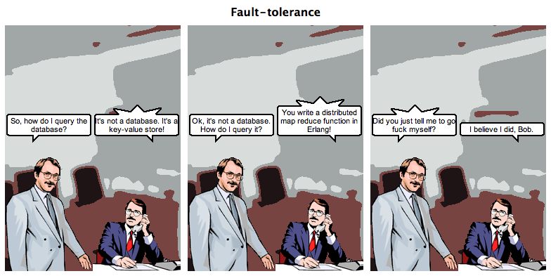
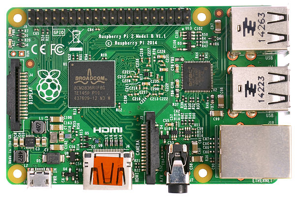
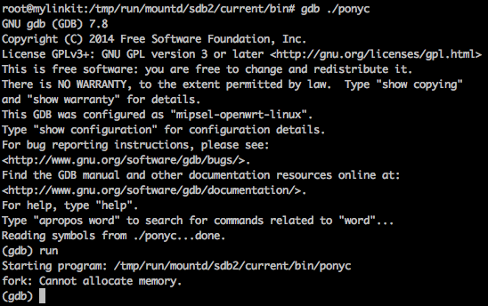
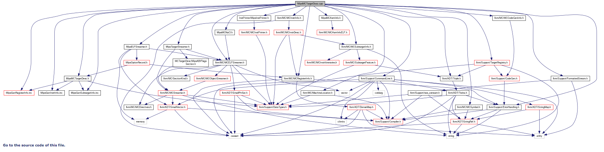

# Big Cluster.
### Little Device.
# Pony Everywhere!


----


# @darachennis
# darach@thingk.io

JOnTheBeach Malaga 2016

----

Pony Padewan


I'm just a geek, who loves a pony

----

Pony Yooda


... written at ICL, London by Clebsch et al

----

## Agenda

Language Features

Capabilities

Actors, Scheduler & Garbage Collector

Quiz!

Benchmark(et)ing

Embedded

Future Work

Conclusion

----

# Pony.

## Fast, safe actors, that don't/won't crash (mostly)

http://ponylang.org

----

The actor-model was invented by Carl Hewitt in 1973.


A Universal Modular Actor Formalism for Artificial Intelligence - 1973

----

Gul Agha's 1985 dissertation developed a foundational model which is the basis of all actor-model programming languages.


[ACTORS: A model of concurrent computation in distributed systems](https://www.cypherpunks.to/erights/history/actors/AITR-844.pdf)

----

Erlang/OTP. The most copied and loved implementation of the actor model. "Let it crash!"



[Making reliable distributed systems in the presence of software errors](http://www.erlang.org/download/armstrong_thesis_2003.pdf)

[Erlang the Movie](https://www.youtube.com/watch?v=xrIjfIjssLE) - [Erlang the Movie II - The Sequel](https://www.youtube.com/watch?v=rRbY3TMUcgQ)

----

Compiler oriented "Let it crash" actor technology.


----

### Actors - Yeah, It's Love!

Combine data, functions and units of execution.

Exploits natural _composable concurrency_.

Make parallel programming easy.


---

## Language Features

* Variables, Fields
* Simple Expressions
* Control Expressions
* Error handling
* Pattern Matching
* Algebraic Types
* Primitives, Traits, Interfaces, Classes
* Actors
* C-like Structures & Embedding
* Delegates

----

## Variables & Fields

```pony
let single_assignment : I64 = 1 // Once and only once assignment
var multiple_assignment : Bool = true // A mutable variable
embed avoid_ptr_indirection : MyStructClass = MyStructClass // Embeddeded class
```
----

## Expressions - *No* precedence

[ a = 1, b = 2, c = 3 ]

```java
long x = a + b * c // Java, C, C++, ... Is x 7 or 9?
```

```erlang
X = A + B * C %% Erlang. Is X 7 or 9?
```

```smalltalk
x := a + b * c "Smalltalk. Is it the same as above?"
```

Pony
```pony
let x : I64 = a + (b * c) // MUST disambiguate
let y : U64 = x + I64(1)  // Error. Not allowed
let y' : U64 = x + I64(1).u64() // If you need to cast. You MUST cast!
let z : U64 = 1 // If pony can safely infer, it will
```
What you get is what you type. Zero cognitive overhead!
----

## Statements *are* expressions

If is an expression
```pony
let x : I64 = if (a and 1) == 1
  then a + (b * c)
  else (a + b) * c
end // Allowed!
```

For is an expression
```pony
var r = Range[U64](1,10) // Min inclusive, Max exclusive
var x : I64 = a + (for i in r do i else 0 end * c) // ok!
```

----

Errors. try ... else ... end block

```pony
use "collections"

actor Main
  new create(env : Env) =>
    let a : U64 = 1
    let b : U64 = 2
    let c : U64 = 3
    try
      x = a + (for i in Range[U64](1,10) do i else 0 end * c)
      env.out.print("for: " + x.string())
    else
      env.err.print("Oh noes!")
    end
```

Error handled in the else block => Error not propagated

----

Errors must be handled - Partial functions

```pony
  new create(env : Env) =>
    try doit() end // If it fails, swallow!

  fun doit() ? =>  
    bad() // If it fails, propagate

  fun bad() ? =>
    error // "This will never work!" #baddumtish
```

We use '?' to annotate a partial fun. Errors ( can be ) propagated

----

Constructors MUST NOT error

```pony
  new create(env : Env) ? =>
    error // Bad pony! Not allowed!
```

Error: actor constructor cannot specify ?

With Constructors there is no error. Do or do not. But do not try!

----

```pony
// Packages: files/file.pony
///
primitive CreateFile
  """
  Open a File for read/write, creating if it doesn't exist, preserving the
  contents if it does exist.
  """
  fun apply(from: FilePath): (File | FileErrNo) =>
    let file = File(from)
    let err = file.errno() // HINT: Workaround the limitation as appropriate

    match err
    | FileOK => file
    else
      err
    end
```
This can be a minor challenge when integrating with native code

----

Erlang Style Pattern Matching [1]

Imperative style - 13 LOC

```pony
actor Main
  let a : U64 = 1
  let b : U64 = 2
  new create(env : Env) =>
    if a == b then
      env.out.print("they are the same")
    else
      if a > b then
        env.out.print("a is bigger")
      else
        env.out.print("b bigger")
      end
    end
```

----

Erlang Style Pattern Matching [2]

Erlang style 9 LOC!

```pony
actor Main
  let a : U64 = 2
  let b : U64 = 1
  new create(env : Env) =>
    env.out.print( match (a, b)
      | where a > b => "a is bigger than b"
      | where a < b => "b is bigger than a"
      else "they are the same"
    end)
```

----

Erlang Style Pattern Matching - Tuples + wildcards

```pony
actor Main
  let a : U64 = 2
  let b : U64 = 1
  new create(env : Env) =>
    env.out.print( match (a, b)
      | (0, _) => "a is zero, so who cares about b? we don't!"
      | where a > b => "a is greater than zero and bigger than b"
      | where a < b => "a is greater than zero but b is bigger than a"
      else "a is greater than zero and they are the same"
    end)
```

Don't care? Use a '_' wildcard

----

Algebraic Type Expressions [1]

```pony
primitive Red
primitive Green
primitive Blue

type Color is ( Red | Green | Blue )              // Enum/Union with '|'
type ColoredThing is ( String, Color )            // Tuple with ','
type MaybeColoredThing is ( ColoredThing | None ) // Option type with '|'

type Map[
  K: (Hashable box & Comparable[K] box), // Intersection with '&'
  V]
  is HashMap[K, V, HashEq[K]]
```

----

Algebraic Type Expressions [2]

Creating, accessing, and  destructuring tuple

```pony
var t : (String, Color)       // Define
t = ("Lamp", Green)           // Construct
t = ("Person", t._2)          // Member access
(let name, var color)  = t    // Destructure
```

----

* Primitives
  1. A __primitive__ has no fields.
  2. There is only one instance of a user defined __primitive__.

```pony
primitive Red
primitive Green
primitive Blue

type Color is ( Red | Green | Blue )

```

* Uses
  1. Nominal marker. Like an erlang Atom
  2. Enumeration. Through unioning
  3. Monostate. 'Package' (related) functions together
  4. Builtins. ( Bool, I8 .. I128, U8 .. U128, F32, F64 )

----

* Traits
  1. Offers __nominal__ subtyping.
  2. No fields
  3. May have default implementations

```pony
trait Named
  fun name(): String => "J. Anonymous Doe"
```

When to use?

* When you want to prevent accidental subtyping

----

Interfaces

Offers __structural__ subtyping. No fields. May have default implementations

```pony
interface val Real[A: Real[A] val] is
  (Stringable & _ArithmeticConvertible & Comparable[A])
  ...
  fun add(y: A): A => this + y

// Define a suitable type
class Pair
  ...
  // Define a + function
  fun add(other: Pair): Pair =>
    Pair(_x + other._x, _y + other._y)

actor Main
  new Create(env : Env) =>
    var x = Pair(1, 2)
    var y = Pair(3, 4)
    env.out.print( (x + y).string() )
```

When to use?  When you want more flexibility. By default, when you can't decide ...

----

Classes

1. Can inherit traits explicitly
2. Can support interfaces (explicitly or implicitly)
  If an interface is explicitly supported default implementations are used
  Otherwise, when using implicit support, default implementatinos are ignored
3. Have constructors. Constructors *MUST* initialize all fields ( RAII )
4. Have fields. May be public or private
5. Can not extend from another class ( YAGNI! )

----

Classes -- Constructors

```pony
class Wombat
  let name: String
  var _hunger_level: U64

  new create(name': String) => // Construct with 'new'
    name = name'
    _hunger_level = 0

  new hungry(name': String, hunger: U64 = 0) => // Need more than one? Ok too
    name = name'
    _hunger_level = hunger
```

----

Classes - Inheritance

```pony
class Wombat is Named // Can be an Algebraic type!
  let name: String
  var _hunger_level: U64

  ...

  fun name() : String =>
    "Sylvan"
```

----

Classes - Functions

```pony
class box Wombat is Named
  let name: String
  var _hunger_level: U64

  ...

  fun hunger() : U64 => _hunger_level

  fun ref set_hunger(to: U64 = 0) =>
    _hunger_level = to // Destructive read!
```

----

Destructive read?

1. In pony assignment is an __expression__
2. As it is an expression it *MUST* return a result
3. The result is the __old__ value ( the one that was destroyed )

We call this a destructive read. It is *very* powerful

```pony
primitive Amazoid
  fun swap[A](a: A, b: A) =>
    a = b = a
```

Look mammy! No temporary variable! \o/

----

Native integration, without the pain

Native to pony?

```pony
@sprintf[I32]("squee!") // #include &lt;stdio.h&gt; - Native with '@'
```

Pony to native?

```pony
actor @SuckItAndSee // Native with '@'
```

```bash
$ ponyc -l my_project
Building my_project -> /Users/darach/Work/Personal/ponyc/my_project
Building builtin -> /usr/local/lib/pony/0.2.1-66/packages/builtin
Generating
Optimising
Writing ./my_project.o
Archiving ./libmy_project.a
$ wc -l my_project.h
97 my_project.h
```

@c_abi - Native integration that's tweet easy and ~zero overhead. ( No 140 byte limit! )

----

### C-like struct's layout [1]


```c
// File: sys/termios.h
...

typedef unsigned long tcflag_t;
typedef unsigned char cc_t;
typedef unsigned long speed_t;

struct termios {
  tcflag_t  c_iflag;  /* input flags */
  tcflag_t  c_oflag;  /* output flags */
  tcflag_t  c_cflag;  /* control flags */
  tcflag_t  c_lflag;  /* local flags */
  cc_t    c_cc[NCCS]; /* control chars */
  speed_t   c_ispeed; /* input speed */
  speed_t   c_ospeed; /* output speed */
};

```

----

### Pony C-struct

```pony
struct TermiosControlChars
  ...

struct Termios
  var iflags : U64 = 0
  var oflags : U64 = 0
  var lflags : U64 = 0
  var cflags : U64 = 0
  embed cc : TermiosControlChars = TermiosControlChars
  var ispeed : U64 = 0
  var ospeed : U64 = 0
```

----

### Delegates [1]

```pony
trait Wombat
  fun box battle_call() : String val =>
    "Huzzah!"

class SimpleWombat is Wombat

class KungFuWombat is Wombat
  fun box battle_call() : String val =>
    "Bonzai!"

trait Drone
  fun box battle_call() : String val =>
    "Beep Boop!"

class DroneWombat is ( Drone & Wombat)
  fun box battle_call() : String val =>
    "Beep boop Huzzah!"
```    

----

### Delegates [2]

```pony
actor Main is Wombat
 let d : Wombat delegate Wombat = DroneWombat
 let k : Wombat delegate Wombat = KungFuWombat

  new create(env : Env) =>
    let x = Time.nanos() % 4

    let chosen_wombat = match x
    | 0 => SimpleWombat
    | 1 => k
    | 2 => d
    else
      this
    end
    env.out.print("Welcome to Wombat Combat!")
    env.out.print("Battle cry: " + chosen_wombat.battle_call())

  fun box battle_call() : String val =>
    "Bonzai! Beep boop! Huzzah!"
```

----

### Object Literals and Lambda

```pony
let notify = object iso
  let term: ANSITerm = term
  fun ref apply(data: Array[U8] iso) => term(consume data)
  fun ref dispose() => term.dispose()
  be my_behaviour() // Anonymous actor!
end
```

```pony
lambda(s: String): String => "lambda: " + s end
```

Lambda here produces the same code as:

```pony
object
  fun apply(s: String): String => "lambda: " + s
end

```

----

LLVM based. Full breakpoint debugging of pony or the runtime with LLDB/GDB!

```
$ ponyc --debug hello
Building hello -> /BeepBoop/hello
Building builtin -> /usr/local/lib/pony/0.2.1-141-ga413261/packages/builtin
Generating
Writing ./hello.o
Linking ./hello1
$ lldb ./hello1
(lldb) target create "./hello1"
Current executable set to './hello1' (x86_64).
(lldb) b main.pony:3
Breakpoint 1: where = hello1`Main_create + 25 at main.pony:3, address = 0x0000000100002919
(lldb) run
Process 30271 launched: './hello1' (x86_64)
Process 30271 stopped
* thread #1: tid = 0xd7e26, 0x0000000100002919 hello1`Main_create(this=0x0000000108fff000, env=0x0000000108ffe800) + 25 at main.pony:3, queue = 'com.apple.main-thread', stop reason = breakpoint 1.1
    frame #0: 0x0000000100002919 hello1`Main_create(this=0x0000000108fff000, env=0x0000000108ffe800) + 25 at main.pony:3
   1    actor Main
   2      new create(env : Env) =>
-> 3        env.out.print("Hello Wombat")
(lldb)
```

----

LLVM based. You can even bypass the compiler backend entirely ( if you're brave! )

```bash
# Script: https://gist.github.com/darach/1b8bfade3f3b2488f6db

# Compile pony in debug mode and generate LLVM IR human readable forms
${PONY_HOME}/build/debug/ponyc --debug -rir $1

# Translate LLVM IR human readable forms into LLVM bitcode
${LLVM_HOME}/llvm-as ${OUT_LL}

# Compile bitcode into assembly listing
${LLVM_HOME}/llc -march ${TARGET_ARCH} ${OUT_BC} -o ${OUT_S}

# Compile bitcode into object
${LLVM_HOME}/llc -march ${TARGET_ARCH} ${OUT_BC} -filetype=obj -o ${OUT_O}

# Link into executable
clang ${OUT_O} -o ${OUT} -L ${PONY_LIBS} -lponyrt -lSystem.B -e _main

# Run executable
./${OUT}
```

[Github Gist](https://gist.github.com/darach/1b8bfade3f3b2488f6db)

----

Not covered

* Generics
* Capability upper bounds ( & viewpoint adaptation )
* Syntax Sugar ( create, apply, update, partial application )
* ...

---

## Capabilities

Every reference indicates a level of isolation or immutability

```pony
x: String iso // An isolated String
x: String val // A globally immutable String
x: String ref // A mutable String
x: String box // A locally immutable String (like C++ const)
x: String tag // An opaque String
```

```pony
x: String trn // A transition type
```

----

Annotations: __iso__, __val__, __ref__, __box__, __tag__, and __trn__

These annotations are called **reference capabilities** ( rcaps )

* They make Pony **data-race free**
* This is a **compile time** guarantee
* This is exploited in the Scheduler, GC **at runtime**

----

They don't specify what permissions are granted.

They specify what capabilities are **denied** of other rcaps to the same object
----

## Deny Properties

| Deny global | aliases | |
-----------------------|--------------|-------------|-----
__Deny local aliases__ | _Read/Write_ | _Write_     | _None_
_Read/Write_           | __iso__      |             |
_Write_                | __trn__      | __val__     |
_None_                 | __ref__      | __box__     | __tag__
                       | _mutable_    | _immutable_ | _opaque_

Note: The iso, val and tag capabilities are sendable. What's interesting about them? ( diagonal )

----

Reference capabilities have a subtype relationship.

```viz
digraph {
  rankdir = LR
  iso -> trn
  trn -> ref
  trn -> val
  ref -> box
  val -> box
  box -> tag
}
```

rcaps use local typing, not global analysis so there is no
global analysis step. This is data-race freedom that scales as
your code-base grows! With actors, it enables **Composable Concurrency**

----

Deny properties are enforced by the compiler:

Shared mutable data is hard. => Not sendable

Immutable data is safely shared. => Sendable

Isolated data is safe. => Sendable

Isolated data may be complex.

Every actor is single threaded. => Composable

----

Example - Isolated

An __iso__ reference to an object must guarantee that there are no readable or writeable aliases to the object, anywhere in the program.

```viz
digraph {
  subgraph cluster_shared {
    label="shared";
    Data [shape=box]
  }
  subgraph cluster_ok {
    label="this is ok";
    Alice -> Data [label=iso]
    Bob -> Data [label="no permissions"]
  }
  subgraph cluster_not_ok {
    label="this is not ok";
    Fred -> Data [label=iso]
    Wilma -> Data [label=writable]
  }
  subgraph cluster_not_ok_either {
    label="this is also not ok";
    Betty -> Data [label=iso]
    Betty -> Data [label=readable]
  }
}
```

<!-- .element: class="fragment"--> Fred could read while Wilma is writing!

<!-- .element: class="fragment"--> Betty could send __iso__ to Fred, but retain a readable ref

<!-- .element: class="fragment"--> Data races! Not allowed in Pony!
----

Example - Value

A __val__ reference to an object must guarantee that there are no writeable aliases to the object, anywhere in the program.

It's ok for readable references to exist, since we won't write to the object.

```viz
digraph {
  Alice
  Bob
  Fred
  Data
  subgraph cluster_shared {
    label="shared";
    Data [shape=box]
  }
  subgraph cluster_ok {
    label="this is ok";
    Alice -> Data [label=val]
    Alice -> Data [label=readable]
    Bob -> Data [label=readable]
  }
  subgraph cluster_not_ok {
    label="this is not ok";
    Fred -> Data [label=writeable]
  }
}
```

<!-- .element: class="fragment"--> Alice, Bob could read while Fred writes

----

Example - Tag

A __tag__ ref to an object doesn't have to make any guarantees about aliases.

It's ok for writeable and readable aliases to exist, since we won't read from the object.

```viz
digraph {
  subgraph cluster_shared {
    label="shared";
    Data [shape=box]
  }
  subgraph cluster_ok {
    label="this is ok";
    Alice -> Data [label=tag]
    Bob -> Data [label=writeable]
  }
  subgraph cluster_ok_too {
    label="this is ok too";
    Wilma -> Data [label=tag]
    Wilma -> Data [label=writeable]
  }
}
```

<!-- .element: class="fragment"--> Since actor behaviours interact asynchronously, we can type actors as __tag__ references.

----

## Consume, Hat & Bang

```
let x: Something iso = ...
let y: Something iso = x // Bad!

doSomething(consume x) // Good! ( destructive read )
let v: Something iso = ...
let w: Something iso = consume v; // Ok.
```

The '^' signifies an **ephemeral** ( or unaliased ) type
An 'iso^' is safe to assign ( not reachable by any other r/w aliases )
A '!' indicates a borrowed ( aliased ) type

'^' and '!' are duals

----

## Recover

```pony
let x : String = String
    x.append("Hello") // Bad! String is a val ( immutable ) by default
```

Recover allows us to 'lift' a reference capability

```pony
let x : String = recover trn String end
x.append("Hello") // Ok! String trn is locally mutable
x.append("World")
```

---

## Actors, Scheduler & Garbage Collector

----

Actors - Like classes, with behaviours:

1. A __behaviour__ is like an _asynchronous_ function.
2. When a behaviour is called, it is scheduled for execution 'later'
3. It does not specify a return type.
4. It returns an instance of itself

----
```
use "debug"
actor PingPong
  let that : PingPong = this // Tee hee!
  be ping() => // Define a behaviour with 'be'
    Debug.out("Ping!")
    that.pong()
  be pong() =>
    Debug.out("Pong!")
    that.ping()
```

Ping pong forever.

----

Actors - Concurrency

1. As a __behaviour__ is _asynchronous_ many can be run at the same time
2. Each scheduler thread can be executing an actor behaviour at any given time
3. Natural concurrency

The number of threads (& yield strategy) can be tuned:

```bash
$ cd my_project
$ ponyc
$ ./my_project --ponythreads=4 --ponynoyield=false # Default on my MBP
$ ./my_project --ponythreads=32 --ponynoyield=true  # I'm feeling lucky!
```

----

Actors - When 'in the box', think sequential

1. Each active actor executes one behaviour at a time
2. This means actor code need not be concerned with concurrency
3. No locks. No semaphores. An actor is a unit of sequentiality
4. Need more parallelism? Spin up more actors!
5. Actors are GC'd for you.

----

Actors - Fast, Safe and Cheap

1. An actor has 240 bytes of memory overhead.
2. No locks. No context switches. All mutation is local
3. An idle actor consumes no resources ( other than memory )
4. You can have millions of actors at the same time

----

### How cheap are actors?

If we have millions of actors, we will have many millions of messages

Messaging has to be cheap

And it has to stay cheap under load

----

### Use cheap messages to move the code to the data

Zero-copy fast message queues
Unbounded ( controversial ) MPSC queue with empty queue detection
* Moves the backpressure problem
  * Not better. Not worse. It's controversial
Messages do not need to be in more than one queue

----

### Pushing a message on to a queue is cheap

```c
bool messageq_push(messageq_t* q, pony_msg_t* m)
{
  m->next = NULL;

  pony_msg_t* prev = (pony_msg_t*)_atomic_exchange(&q->head, m);

  bool was_empty = ((uintptr_t)prev & 1) != 0;
  prev = (pony_msg_t*)((uintptr_t)prev & ~(uintptr_t)1);

  _atomic_store(&prev->next, m);

  return was_empty;
}
```

A single atomic operation, wait-free, integrated empty queue detection
The `_atomic_store` doesn't need an atomic op on X86 or ARM

----

### Popping a message off of a queue is cheap

```c
pony_msg_t* messageq_pop(messageq_t* q)
{
  pony_msg_t* tail = q->tail;
  pony_msg_t* next = _atomic_load(&tail->next);

  if(next != NULL)
  {
    q->tail = next;
    pool_free(tail->size, tail);
  }

  return next;
}
```

Zero atomic operations, stub nodes for memory management
The `_atomic_load` doesn't need an atomic op on X86 or ARM

----

### Zero-copy messages

The type system ( rcaps! ) guarantees the program is data-race free

Messages can be passed by reference instead of being copied

Without locking

Without atomic reference counting

----

### Scheduler threads

The Pony runtime can be started with any number of scheduler threads

Defaults to physical core count

The program doesn't have to be aware of the thread count

----

### A scheduler thread consists of

1. A kernel thread pinned to a core
2. A single-producer multiple-consumer ( SPMC ) queue of actors with pending messages
3. A message queue for quiescence detection
4. A pool allocator

----

### SPMC Queue

Similar to the MPSC message queue

Unbounded, non-intrusive

Zero atomic operations to push an actor on to the queue

CAS loop to pop an actor off of the queue

----

### Message Batching

A scheduler thread executes a batch of messages on an actor

This is to amortise the cost of popping an actor off a scheduler queue

Today this is a fixed number, in the future it will be dynamic

----

### Why are scheduler queues SPMC?

When an actor is sent a message...

* If the actor's message queue wasn't empty
  - Then it is already on some scheduler thread: do nothing
* If the actor's message queue was empty
  - Then the actor wasn't scheduled anywhere
  - Schedule it on the queue of the thread that is sending the message
  - Because the actor's working set probably isn't in cache
  - So get cache locality for the message contents, if possible

_Only the scheduler thread ever puts an actor on its own queue_

----

### Quiescence detection

Scheduler threads are actually actors

They use a quiescence detection messaging protocol to terminate a program

The protocol is I/O aware, and can correctly terminate a program before all actors are garbage collected

A program has terminated when it is not listening for input, there are no pending messages, and no new messages will ever be generated

----

### Fully concurrent with no stop-the-world

GC'ing an actor heap

GC'ing things shared across heaps

GC'ing actors themselves

----

### What actor heap GC doesn't need

No safepoints

No read or write barriers

No card table marking

No compacting, so no pointer fixups

No need for 800 tunables and a degree in theoretical physics to tune the VM!

No stop the world

----

### Adrian Colyer's write up

_Ownership and Reference Counting Based Garbage Collection in the Actor World_

http://blog.acolyer.org/2016/02/18/ownership-and-reference-counting-based-garbage-collection-in-the-actor-world/

---

## Quiz Time

----

```pony
actor ThisIsTheQuestion
  var alive : Bool = true

  be ref kill() => alive = false

  be loop() =>
    while alive do
      Debug.out("Immoral? Immortal?")
    end
```

"All languages die in an infinite loop... except Agda and Idris" - Sylvan Clebsch

----

What happens if we call loop() before kill()?

```pony
actor Main
  new create(env : Env) =>
    let rascal = ThisIsTheQuestion
    rascal.loop()
    rascal.kill()
```

<!-- .element: class="fragment"--> Never dies!

----

What happens if we call kill() before loop()?

```pony
actor Main
  new create(env : Env) =>
    let rascal = ThisIsTheQuestion
    rascal.kill()
    rascal.loop()
```

<!-- .element: class="fragment"--> Never lives!

----

Pony actors support __causal messaging delivery__

Each message is an effect, and previously sent or received messages are a cause of that
effect. Causal message delivery guarantees that the cause of a message is always enqueued in
an actors mailbox before its effect. - Sebastian Blessing, <a href="http://www.doc.ic.ac.uk/teaching/distinguished-projects/2013/s.blessing.pdf">A String of Ponies</a>

This enables its *killer* feature:

<a href="http://www.doc.ic.ac.uk/~sc5511/opsla237-clebsch.pdf">Fully concurrent garbage collection of actors on Many-Core Machines</a>

Which, through extending the termination protocol can extend to the distributed case (see: A String of Ponies!)

----


```pony
actor ThisIsTheAnswer
  var alive : Bool = true
  be kill() =>
    Debug.out("Killing")
    alive = false
  be loop() =>
      match alive
      | true =>
        this.loop()
      | false => Debug.out("Done!") ; None
      end
```

<!-- .element: class="fragment"--> Use tail recursive behaviours!

----

```pony
actor Main
  new create(env : Env) =>
    var rascal = ThisIsTheAnswer
    Debug.out("Interruptible Causal messaging FTW!")
    rascal.loop().kill() // Causal behaviour chaining \o/
```

Loop forever or until we die if we receive exactly one kill message.

```bash
$ ./run_rascal_run
Interruptible Causal messaging FTW!
Beep boop!
Killing
Done!
[Finished in 1.0s]
```

Run it as much as you like, ... the order is preserved!

"All languages die in an infinite loop... except Agda, Idris and Pony" - @darachennis

Sylvan - You can remove the loopy control structures now! :)

---

## Benchmark(et)ing

### How fast is pony anyway?

( Lies, Lies and Fibonacci micro-benchmarks )

----

Imperative Style Fib

```pony
primitive Imperative
  fun fib(n: U64) : U64 =>
    if ( n == 0 ) then
      0
    elseif ( n == 1) then
      1
    else
      fib(n-1) + fib(n-2)
    end
```

----

Non Tail-Recursive Erlang Style Pattern Match Fib

```pony
primitive Functional
  fun fib(n: U64) : U64 =>
    match n
    | 0 => 0
    | 1 => 1
    else
      fib(n-1) + fib(n-2)
    end
```

----

Tail-Recursive Erlang Style Pattern Match Fib

```pony
primitive TailRecursive
  fun fib(n: U64) : U64 =>
    _fib_iter(n, 0, 1)

  fun _fib_iter(n: U64, result: U64, next: U64) : U64 =>
    match n
    | 0 => result
    else
      _fib_iter(n-1,next,result+next)
    end
```

----

|Language|Non Tail-Recursive|Tail-Recursive|
|---|---|---|
|Pony|1x|1x|
|C|-1.34x|-1.33x|
|Java|-7.8x|-1.56x|
|Erlang[1]|-332x|-60x|

Fib: N=37, I=10000 ( 1 benchmark unit )

|Language|Imperative|Non Tail-Recursive|Tail-Recursive|
|---|---|---|---|
|Pony|79K|66K|1 <- Amazoid!|

Imperative? Non-tail-recursive? Meh!

[1]: Erlang arbitrary precision, rest are 64bit ( admittedly unfair )

[2]: It's so fast it's faster than C fast

[3]: No tuning, optimization or special consideration for any runtime.

---

## Embedded.

ARM - eg: RPi Model B V2 - 1 GB RAM, Quad core ARM Cortex 900 MHz, $35



----

MIPS - eg: MediaTek Linkit Smart 7688 - 32MB Flash, 128MB RAM, 1 MIPS32r2 Core 512 MHz, $12


----

There may be some challenges!



----

LLVM is Awesome-ly complicated



----

## Demo!

---

## Future Work

----

(It's not a Future, it's a Promise)

* Type specialisation.
* Values as type parameters.
* Functional programming style overloading. ( done! )
* Embedded fields and C-struct definitions. ( done! )
* Monitorable, linkable, supervisable actors.
* Distributed multi-node Pony. ( research! )
* ARM backend. ( done! )
* 32-bit backend. ( done! )
* More meta-programming facilities.
* Distributed Pony

----

Type specialisation example:

```pony
type Map[K, V, H: HashFunction[K] val = F] where
  F = match K
  | (Hashable #read & Equatable[K] #read) => HashEq[K]
  else HashIs[K]
  end
```

----

Values as type parameters example:

```pony
class Vector[A, n: U64]

class Matrix[A, n: U64, dim: Vector[U64, n]]
```

----

Fib as an FP overloading example (done!):

```pony
primitive Functional
  fun fib(0): U64 => 0
  fun fib(1): U64 => 1
  fun fib(n: U64): U64 => fib(n - 1) + fib(n - 2)
```

---

### Conclusions

Come get involved!

Join our community of students, hobbyists, industry developers, tooling developers, library writers, compiler hackers, and type system theorists.

Why not you?

----

### Community Resources

http://ponylang.org @ponylang (twitter) #ponylang (irc)

Pony Virtual User Group - https://pony.groups.io/g/vug

Pony Developers - https://pony.groups.io/g/dev

Pony Tutorial - http://tutorial.ponylang.org/

Pony Patterns - http://patterns.ponylang.org/

Pony Standard Library Docs - http://www.ponylang.org/ponyc/

Pony RFCs - https://github.com/ponylang/rfcs

----

## Questions


